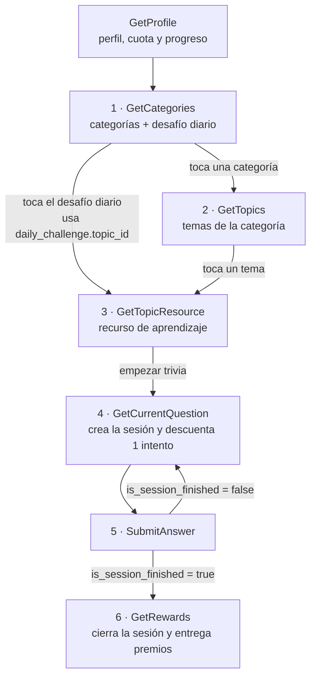

# Módulo Trivias — Documentación de servicios gRPC

Referencia completa de los métodos expuestos por `TriviaService`, el flujo de pantallas y el
diccionario de códigos de respuesta. Este documento describe el **mock de integración**: la lógica
de negocio y los estados son reales, el contenido (temas, preguntas, recursos) es de prueba.

* **Package proto:** `trivia`
* **Servicio:** `trivia.TriviaService`
* **Archivos necesarios para generar el cliente:** `trivia.proto` y `base_response.proto`
  (el primero importa al segundo, hay que compilarlos juntos)
* **Endpoint del mock:** `http://localhost:5136` (h2c, sin TLS)
* **Reflection gRPC:** no está habilitada — generen el cliente desde los `.proto`

---

## 1. Convenio de comunicación

El canal gRPC **siempre responde `OK` (0)**, incluso ante errores de negocio. El resultado real
viaja dentro del payload, en el envoltorio `BaseResponse` que todos los métodos comparten:

| Campo | Tipo | Uso |
| :--- | :--- | :--- |
| `status_code` | `string` | **Campo a evaluar siempre.** `"SUC000"` = éxito; cualquier otro valor es un error de negocio (ver §7). |
| `message` | `string` | Texto listo para mostrar al usuario. **Vacío cuando `status_code` es `"SUC000"`.** |
| `data` | objeto | El payload útil. Presente solo en respuestas exitosas. |
| `errors` | `repeated ErrorPb` | Existe en el contrato pero **ningún método lo usa**. No dependan de él para detectar errores. |
| `exception` | `ExceptionDetailPb` | Ídem: declarado, no utilizado. |

> [!IMPORTANT]
> No usen el status code del canal gRPC para decidir si la operación salió bien. La única fuente de
> verdad es `data.status_code` del payload.

### Autenticación

* Se envía como metadato gRPC: `Authorization: Bearer <jwt>`.
* Del payload del JWT se leen dos claims: `id_user_profile` (obligatorio) y `document_number`.
  También se aceptan en camelCase (`idUserProfile`, `documentNumber`).
* El servicio valida **únicamente** que (a) el token esté presente → si no, `ERR009`, y (b) que el
  claim `id_user_profile` exista y sea legible → si no, `ERR011`. **No valida firma, expiración ni
  formato exacto**: eso es responsabilidad del gateway.
* **Usuarios registrados en el mock:** `id_user_profile` = `"1"` (John) y `"2"` (Fiora). Cualquier
  otro valor devuelve `ERR010`.
* Ambos usuarios arrancan con sucursal de apertura **La Paz (`LP`)**, 3 intentos semanales, 250 XP
  y 50 Yasta Coins.

---

## 2. Mapa del flujo



| # | Pantalla | Método | Entrada principal |
| :-- | :--- | :--- | :--- |
| — | Perfil, cuota semanal y progreso | `GetProfile` | *(solo el token)* |
| 1 | Categorías + desafío diario | `GetCategories` | `department_code` |
| 2 | Temas de la categoría *(se omite si se entró por el desafío diario)* | `GetTopics` | `department_code`, `category_code` |
| 3 | Recurso de aprendizaje (uno solo) | `GetTopicResource` | `topic_id` |
| 4 | Pregunta actual de la trivia | `GetCurrentQuestion` | `department_code`, `topic_id` |
| 5 | Envío de respuesta | `SubmitAnswer` | `trivia_session_id`, `question_id`, `selected_option_id` |
| 6 | Recompensas / cierre | `GetRewards` | `trivia_session_id` |

**Reglas del recorrido**

* El **desafío diario es un tema puntual**, no una categoría. Al tocarlo, la app **salta la pantalla
  2** y va directo a `GetTopicResource` con el `topic_id` que viene en `daily_challenge`. De ahí en
  adelante el flujo es idéntico al normal.
* `GetTopicResource` **no crea sesión ni consume intentos**: es solo la pantalla de aprendizaje previa.
* El intento semanal se descuenta **al crear la sesión**, es decir en la primera llamada a
  `GetCurrentQuestion` con `topic_id` y sin `trivia_session_id`. Reanudar una sesión existente del
  mismo tema **no vuelve a descontar**.
* La sesión se identifica por **usuario + departamento + tema**: se pueden tener sesiones abiertas en
  temas distintos en paralelo.

---

## 3. Catálogo de contenido

**4 categorías × 4 temas = 16 temas.** Cada tema tiene un banco de **15 preguntas** del cual la
sesión toma **10 al azar**, así que repetir un tema no repite el mismo set ni el mismo orden.

| Categoría (`category_code`) | Label | `icon_key` | Tema (`topic_id`) | Título |
| :--- | :--- | :--- | :--- | :--- |
| `educacion_financiera` | Educación Financiera | `icon_finance` | `ef_presupuesto` | Presupuesto |
| | | | `ef_ahorro` | Ahorro |
| | | | `ef_creditos` | Créditos |
| | | | `ef_garantias` | Garantías |
| `medio_ambiente` | Medio Ambiente | `icon_environment` | `ma_reciclaje` | Reciclaje y residuos |
| | | | `ma_agua` | Agua y glaciares |
| | | | `ma_biodiversidad` | Biodiversidad y áreas protegidas |
| | | | `ma_energia` | Energía y cambio climático |
| `equidad_genero` | Equidad de Género | `icon_gender` | `eg_trabajo` | Equidad laboral |
| | | | `eg_cuidado` | Corresponsabilidad y cuidado |
| | | | `eg_liderazgo` | Liderazgo y participación |
| | | | `eg_educacion` | Educación y brecha digital |
| `derechos_mujer` | Derechos de la Mujer | `icon_women` | `dm_marco_legal` | Marco legal |
| | | | `dm_violencia` | Prevención de violencia |
| | | | `dm_salud` | Salud y maternidad |
| | | | `dm_patrimonio` | Derechos patrimoniales |

El tipo de recurso de cada tema **no se hardcodea en el cliente**: llega en el campo `resource_type`
(en `TopicPb` y en `DailyChallengePb`) y en `resource.type` de `GetTopicResource`.

### Departamentos

| Departamento | Código | | Departamento | Código |
| :--- | :--- | :-- | :--- | :--- |
| Beni | `BE` | | Pando | `PD` |
| Chuquisaca | `CH` | | Potosí | `PT` |
| Cochabamba | `CB` | | Santa Cruz | `SC` |
| La Paz | `LP` | | Tarija | `TJ` |
| Oruro | `OR` | | | |

### Vocabulario de estados

| Concepto | Valores posibles |
| :--- | :--- |
| Estado de categoría y de tema | `"not_started"` · `"in_progress"` · `"completed"` |
| Estado de departamento | `"locked"` · `"unlocked"` · `"in_progress"` · `"completed"` |
| Tipo de recurso (`resource_type`, `resource.type`) | `"pdf"` · `"image"` · `"video"` — el contenido cargado hoy en el mock es **todo de tipo `"image"`** |

Los ids de opción se derivan del id de la pregunta: `ef_presupuesto_q01_a` … `_d`.

---

## 4. Referencia de métodos

### 4.1 `GetProfile`

`GetProfileRequestPb` → `GetProfileBaseResponsePb`

**Entrada:** ninguna, solo el token.

**Salida (`data`):**

| Campo | Tipo | Detalle |
| :--- | :--- | :--- |
| `user` | `UserProfilePb` | `id`, `name`, `gender`, `age`, `account_opening_branch` |
| `quota` | `UserQuotaPb` | `weekly_attempts_max` (3), `weekly_attempts_left`, `next_reset_date` |
| `global_progress` | `GlobalProgressPb` | `total_xp`, `total_yasta_coins`, `departments[]` |

`DepartmentProgressPb`: `code`, `name`, `status`, `completed_questions`, `total_questions`,
`completed_topics`, `total_topics`. Los contadores se expresan en preguntas de sesión:
`completed_topics * 10` sobre `16 * 10 = 160`.

`next_reset_date` viene en formato `dd/MM/yyyy` (ej. `13/07/2026`), sin hora ni offset. La cuota se
repone los **lunes 00:00 hora Bolivia**.

**Errores:** `ERR009`, `ERR010`, `ERR011`.

---

### 4.2 `GetCategories`

`GetCategoriesRequestPb` → `GetCategoriesBaseResponsePb`

**Entrada:** `department_code`. Si se envía vacío, se asume la sucursal de apertura del usuario.

**Salida (`data`):** `department_code`, `department_name`, `department_status`, `categories[]` y
`daily_challenge`.

`CategoryPb`: `code`, `label`, `icon_key`, `description`, `total_topics`, `completed_topics`,
`status`. Los contadores se calculan **para ese departamento**: el mismo tema puede estar completado
en La Paz y sin empezar en Santa Cruz.

`DailyChallengePb`:

| Campo | Detalle |
| :--- | :--- |
| `date` | `dd/MM/yyyy`, hora Bolivia |
| `topic_id` | **El destino del tap:** se pasa directo a `GetTopicResource` |
| `topic_title`, `category_code`, `category_label`, `icon_key` | Datos para pintar la card |
| `title`, `description` | Textos ya redactados para el usuario |
| `total_questions` | Siempre 10 |
| `status` | ⚠️ Referido **solo a hoy** (ver abajo) |
| `best_score`, `times_completed` | **Históricos** del tema, no del día |
| `resource_type` | `"pdf"` \| `"image"` \| `"video"` |

> [!WARNING]
> **`daily_challenge.status` NO es lo mismo que `TopicPb.status`.** El primero se refiere solo al día
> de hoy; el segundo es el histórico del tema.
>
> * `"completed"` → el usuario reclamó recompensas de este tema **hoy** (hora Bolivia). Es el valor
>   con el que se pinta "ya cumpliste el reto de hoy".
> * `"in_progress"` → tiene una sesión abierta de este tema, incluido el caso de haber respondido las
>   10 preguntas y no haber llamado aún a `GetRewards`.
> * `"not_started"` → todo lo demás. **Si el usuario completó este mismo tema en otra fecha, hoy
>   vuelve a llegar `"not_started"`**, porque el reto de hoy sigue pendiente.

El tema destacado **rota de forma determinística según la fecha** (hora Bolivia, UTC-4) y es el mismo
para todos los usuarios ese día. No requiere persistencia: si la app lo calcula por su cuenta,
coincidirá con el backend. La categoría cambia cada día — dos días seguidos nunca caen en la misma — y
el ciclo completo recorre los 16 temas. El desafío diario **no otorga recompensas ni intentos
aparte**: es un atajo al mismo tema, con las mismas reglas de cuota.

**Errores:** `ERR007` (departamento bloqueado), `ERR013` (departamento inexistente), `ERR009`, `ERR010`, `ERR011`.

---

### 4.3 `GetTopics`

`GetTopicsRequestPb` → `GetTopicsBaseResponsePb`

**Entrada:** `department_code` (opcional) y `category_code` (requerido).

**Salida (`data`):** `department_code`, `category_code`, `category_label`, `icon_key` y `topics[]`.

`TopicPb`: `id`, `title`, `description`, `icon_key`, `category_code`, `total_questions` (siempre 10),
`status`, `best_score`, `times_completed`, `resource_type` e `is_daily_challenge`.

* `resource_type` viene aquí para que la card del tema muestre el ícono del recurso **sin** llamar a
  `GetTopicResource`.
* `is_daily_challenge` va en **cada tema**, no a nivel de la respuesta: sirve para pintar el badge de
  "desafío diario" en el tema que hoy es el reto.

**Errores:** `ERR016` (`category_code` inválido), `ERR007`, `ERR013`, `ERR009`, `ERR010`, `ERR011`.

---

### 4.4 `GetTopicResource`

`GetTopicResourceRequestPb` → `GetTopicResourceBaseResponsePb`

**Entrada:** `topic_id`. **No requiere `department_code`**, no crea sesión y no consume intentos.

**Salida (`data`):** `topic_id`, `topic_title`, `category_code`, `category_label`, `total_questions`,
`is_daily_challenge` y **un único** `resource`.

`TopicResourcePb` tiene exactamente **4 campos**: `type` (`"pdf"` | `"image"` | `"video"`), `title`,
`description` y `url`. No hay thumbnail, duración ni número de páginas.

Como el desafío diario entra directo a esta pantalla, `is_daily_challenge` permite mostrar el badge
sin haber pasado por `GetTopics`.

> [!NOTE]
> Las URLs del mock apuntan a `https://cdn.yasta.bo/trivias/recursos/...` y son **ficticias**: el
> dominio no existe y no sirve contenido. Sirven para validar el contrato y el parseo, **no para
> renderizar** la imagen.

**Errores:** `ERR017` (`topic_id` inválido), `ERR019` (tema sin recurso), `ERR009`, `ERR011`.
Este método **no** devuelve `ERR010`: valida el token pero no resuelve al usuario, porque el recurso
es el mismo para todos.

---

### 4.5 `GetCurrentQuestion`

`GetCurrentQuestionRequestPb` → `GetCurrentQuestionBaseResponsePb`

**Entrada:** `department_code`, `topic_id` y `trivia_session_id` (opcional).

| Caso | Qué enviar | Efecto |
| :--- | :--- | :--- |
| **Iniciar** una trivia | `topic_id`, **sin** `trivia_session_id` | Crea la sesión y **descuenta 1 intento semanal**. Si falta `topic_id` → `ERR020` |
| **Continuar / reanudar** | `trivia_session_id` | Devuelve la pregunta pendiente. **No descuenta intento**. `topic_id` es opcional; si se envía y no coincide con el de la sesión → `ERR018` |

**Salida (`data`):** `trivia_session_id`, `department`, `current_question_number`, `total_questions`,
`question`, `topic_id`, `topic_title`, `category_code`, `category_label`.

`TriviaQuestionPb`: `id`, `title`, `options[]` (`QuestionOptionPb` con `id` y `text`), `category`,
`category_label`, `category_icon_key`, `topic_id`, `topic_title`.

`total_questions` es siempre **10** (el tamaño de la sesión), no el tamaño del banco del tema.
Los datos de tema y categoría se repiten en la respuesta para poder renderizar el encabezado de la
trivia sin guardar estado local.

**Errores:** `ERR001` (sesión ya terminada), `ERR002`, `ERR006` (sin intentos), `ERR012`, `ERR014`,
`ERR015`, `ERR017`, `ERR018`, `ERR020`, `ERR007`, `ERR013`, `ERR009`, `ERR010`, `ERR011`.

---

### 4.6 `SubmitAnswer`

`SubmitAnswerRequestPb` → `SubmitAnswerBaseResponsePb`

**Entrada:** `trivia_session_id`, `question_id`, `selected_option_id`.

**Salida (`data`):**

| Campo | Detalle |
| :--- | :--- |
| `is_correct` | Si la opción elegida era la correcta |
| `correct_option_id` | Para resaltar la respuesta correcta aunque el usuario falle |
| `explanation` | Texto educativo para mostrar tras responder |
| `is_session_finished` | `true` cuando se respondió la pregunta 10 → toca llamar a `GetRewards` |
| `xp_earned` | `50` si acertó, `0` si no |
| `current_question_number`, `total_questions`, `correct_answers_so_far` | Contadores, para que la app no lleve el conteo por su cuenta |

El `question_id` debe corresponder a la pregunta actual de la sesión; si se envía otra (o fuera de
orden) → `ERR003`. La opción debe pertenecer a esa pregunta, si no → `ERR008`.

**Errores:** `ERR001`, `ERR002`, `ERR003`, `ERR005` (sesión expirada), `ERR008`, `ERR012`, `ERR015`,
`ERR009`, `ERR010`, `ERR011`.

---

### 4.7 `GetRewards`

`GetRewardsRequestPb` → `GetRewardsBaseResponsePb`

**Entrada:** `trivia_session_id`. Solo se puede llamar con las 10 preguntas respondidas; si no →
`ERR004`. **Cierra y elimina la sesión**: una segunda llamada con el mismo id devuelve `ERR002`.

**Salida (`data`):** `session_id`, `department`, `score` (`correct_answers`, `total_questions`),
`rewards_earned` (`xp_bonus`, `yasta_coins`), `message`, `weekly_attempts_left`, `department_status`,
`unlocked_department_codes[]`, `topic_id`, `topic_title`, `category_code`, `category_label`,
`topic_status`, `best_score`, `completed_topics_in_department`, `total_topics_in_department`.

**Cálculo de XP y monedas**

* Cada respuesta correcta otorga **50 XP**.
* Completar las 10 preguntas otorga un bono fijo de **100 XP**.
* `rewards_earned.xp_bonus` = `(respuestas correctas × 50) + 100`
* `rewards_earned.yasta_coins` = `respuestas correctas × 10`

**Errores:** `ERR002`, `ERR004`, `ERR005`, `ERR015`, `ERR017`, `ERR010`, `ERR009`, `ERR011`.

---

## 5. Reglas de negocio transversales

**Cuota semanal**

* `weekly_attempts_max` = **3**. Se descuenta uno al crear la sesión, no al ver el recurso.
* Se repone los **lunes 00:00 hora Bolivia** (UTC-4, sin horario de verano).
* Sin intentos disponibles → `ERR006` al intentar iniciar una trivia nueva.

**Sesiones**

* Expiran a los **30 minutos de inactividad** → `ERR005`.
* Abandonar una trivia **no devuelve el intento**: ya fue descontado al iniciar. El tema queda en
  `"in_progress"` y volver a jugarlo consumirá un intento nuevo.
* Cada sesión fija su propia muestra de 10 preguntas del banco de 15, en orden aleatorio.

**Progreso y desbloqueo**

* Un **tema** queda `"completed"` al reclamar recompensas de una sesión de ese tema. Volver a jugarlo
  es posible: consume un intento y solo actualiza `best_score` y `times_completed`.
* Un **departamento** pasa a `"completed"` cuando el usuario completó **al menos un tema de cada una
  de las 4 categorías** en ese departamento (4 sesiones). Se eligió esta regla porque exigir los 16
  temas haría inalcanzable el desbloqueo con la cuota de 3 intentos semanales.
* Al completar la **sucursal de apertura** se desbloquean los demás departamentos, y sus códigos
  llegan en `unlocked_department_codes` (solo los que se desbloquearon en esa llamada).
* El progreso es **por departamento**: el mismo tema puede estar completado en La Paz y sin empezar
  en Santa Cruz.

> [!WARNING]
> Con 3 intentos semanales, completar un departamento requiere 4 sesiones, es decir **dos semanas de
> cuota**. Si necesitan validar el desbloqueo en una sola corrida de pruebas, avísennos y subimos
> `WeeklyAttemptsMax` en el mock (`TriviaMockDatabase.WeeklyAttemptsMax`).

---

## 6. Diccionario de códigos de respuesta

Si una petición falla por lógica de negocio, se retorna un `status_code` distinto de `"SUC000"` con
su respectivo mensaje sugerido para mostrar al usuario. Cuando la operación es exitosa (`"SUC000"`),
la respuesta **no incluye `message`**, solo el objeto `data` correspondiente.

| `status_code` | Descripción de Negocio / Escenario | Mensaje Sugerido para la UI |
| :--- | :--- | :--- |
| **`SUC000`** | Operación exitosa | *(sin mensaje — solo se retorna `data`)* |
| **`ERR001`** | La sesión de trivia ya ha finalizado | "La sesión ya ha finalizado. Por favor reclame sus recompensas." |
| **`ERR002`** | Sesión de trivia no encontrada | "La sesión de trivia no fue encontrada." |
| **`ERR003`** | `question_id` incorrecto o fuera de orden | "La pregunta enviada no corresponde al orden actual de tu sesión de trivia." |
| **`ERR004`** | La sesión de trivia aún no ha sido completada | "La sesión de trivia aún no ha sido completada. Debes responder todas las preguntas antes de reclamar tus recompensas." |
| **`ERR005`** | Sesión de trivia expirada por inactividad (30 min) | "La sesión de trivia ha expirado por inactividad." |
| **`ERR006`** | Sin intentos semanales disponibles (`weekly_attempts_left = 0`) | "Has agotado tus intentos semanales permitidos para jugar trivias." |
| **`ERR007`** | Departamento seleccionado está bloqueado | "El departamento seleccionado está bloqueado. Debes completar primero tu departamento de apertura." |
| **`ERR008`** | `selected_option_id` inválido para la pregunta | "La opción seleccionada es inválida o no corresponde a la pregunta." |
| **`ERR009`** | No autenticado: token no proporcionado | "No autenticado. Token de autenticación no proporcionado." |
| **`ERR010`** | El `id_user_profile` del token no corresponde a ningún usuario registrado | "No se encontró un usuario registrado con el id_user_profile del token." |
| **`ERR011`** | El claim `id_user_profile` no se encuentra en el token | "No autenticado. El claim 'id_user_profile' no se encuentra en el token." |
| **`ERR012`** | No se pudo recuperar la pregunta actual de la sesión | "No se pudo recuperar la pregunta de la sesión de trivia." |
| **`ERR013`** | `department_code` inválido o inexistente | "El código de departamento no es válido." |
| **`ERR014`** | El `department_code` no corresponde al de la sesión especificada | "El department_code no corresponde al departamento de la sesión de trivia especificada." |
| **`ERR015`** | La sesión de trivia no pertenece al usuario autenticado | "La sesión de trivia especificada no pertenece al usuario autenticado." |
| **`ERR016`** | `category_code` inválido o inexistente | "La categoría no es válida." |
| **`ERR017`** | `topic_id` inválido o inexistente | "El tema no es válido." |
| **`ERR018`** | El `topic_id` no corresponde al tema de la sesión especificada | "El topic_id no corresponde al tema de la sesión de trivia especificada." |
| **`ERR019`** | El tema no tiene recurso de aprendizaje configurado | "No se encontró un recurso de aprendizaje para el tema." |
| **`ERR020`** | Falta `topic_id` al iniciar una nueva sesión | "Debe especificar un topic_id para iniciar una nueva sesión de trivia." |

Los mensajes son **constantes**: no llevan valores interpolados, así que se pueden mapear a textos
localizados del lado del cliente usando solo el `status_code`.

---

## 7. Probar el mock con `grpcurl`

Token de prueba para `id_user_profile = "1"` (firma irrelevante, el mock no la valida):

```
eyJhbGciOiJIUzI1NiJ9.eyJpZF91c2VyX3Byb2ZpbGUiOiIxIiwiZG9jdW1lbnRfbnVtYmVyIjoiMTIzNDU2In0.sig
```

Ejecutar desde la raíz del proyecto (donde está la carpeta `Protos/`):

```bash
JWT="eyJhbGciOiJIUzI1NiJ9.eyJpZF91c2VyX3Byb2ZpbGUiOiIxIiwiZG9jdW1lbnRfbnVtYmVyIjoiMTIzNDU2In0.sig"

# Atajo: call <Metodo> <json>
call() {
  grpcurl -plaintext -import-path ./Protos -proto trivia.proto \
    -H "authorization: Bearer $JWT" -d "$2" \
    localhost:5136 "trivia.TriviaService/$1"
}

# Perfil, cuota y progreso
call GetProfile '{}'

# Pantalla 1: categorías + desafío diario
call GetCategories '{"department_code":"LP"}'

# Pantalla 2: temas de una categoría
call GetTopics '{"department_code":"LP","category_code":"educacion_financiera"}'

# Pantalla 3: recurso del tema (también es el destino del desafío diario)
call GetTopicResource '{"topic_id":"ef_presupuesto"}'

# Pantalla 4: iniciar la trivia (descuenta 1 intento y devuelve trivia_session_id)
call GetCurrentQuestion '{"department_code":"LP","topic_id":"ef_presupuesto"}'

# Pantalla 5: responder (repetir hasta is_session_finished = true)
call SubmitAnswer '{"trivia_session_id":"<id>","question_id":"<id>","selected_option_id":"<id>"}'

# Pantalla 6: recompensas
call GetRewards '{"trivia_session_id":"<id>"}'
```

> [!NOTE]
> El estado del mock vive **en memoria**: reiniciar el servidor resetea progreso, sesiones e intentos
> de todos los usuarios.
